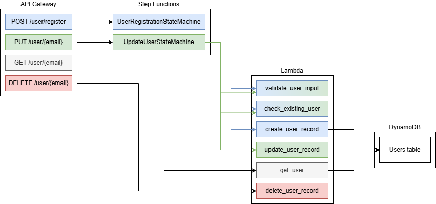
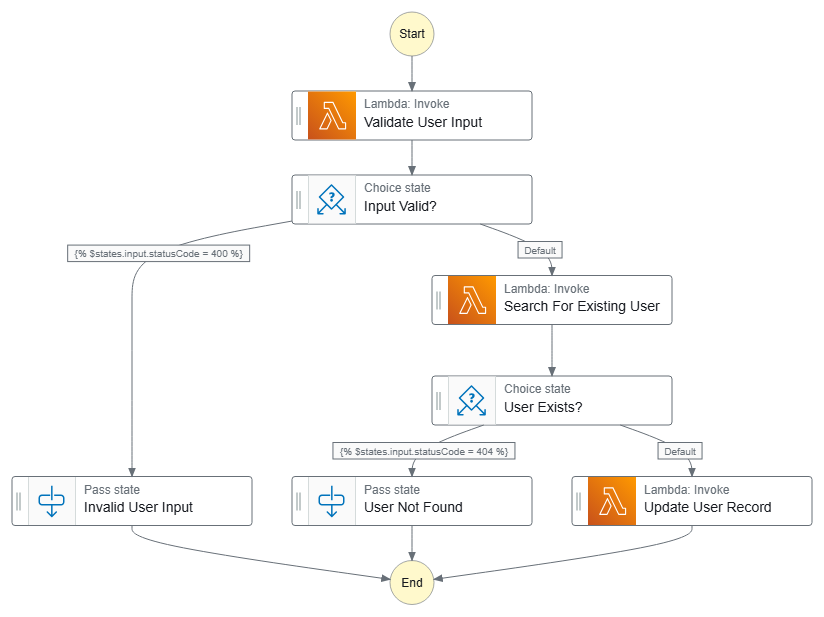

# User Management REST API

This project implements a REST API for user management using Python, AWS Step Functions, Lambda, and API Gateway. The API provides endpoints for user registration, updating user information, retrieving user details, and deleting users.

## Limitations

This project is for demonstration purposes only. Passwords are stored as plain text in the database which you should never ever do in a production application. 

## Endpoints

- **POST /register**: Register a new user.
- **GET /user/{email}**: Retrieve a user's details.
- **PUT /user/{email}**: Update an existing user's information.
- **DELETE /user/{email}**: Delete a user.

## Architecture

- **AWS Lambda**: Used to implement the business logic for each endpoint.
- **AWS Step Functions**: Orchestrates the workflow for user registration and updating user information.
- **DynamoDB**: Stores user data.
- **API Gateway**: Exposes the API endpoints.
- **ALB (Application Load Balancer)**: Routes traffic to the API Gateway.

## Lambda Functions

### validate_user_input.py

Validates the user input for registration and updating user information.

### check_existing_user.py

Checks if a user already exists in the DynamoDB table.

### create_user_record.py

Creates a new user record in the DynamoDB table.

### update_user_record.py

Updates an existing user record in the DynamoDB table.

### get_user.py

Retrieves a user record from the DynamoDB table.

### delete_user.py

Deletes a user record from the DynamoDB table.

## Step Functions

### User Registration

This workflow registers a new user if it does not already exist. It calls the following Lambda functions:

- `validate_user_input`
- `check_existing_user`
- `create_user_record`

### Update User

This workflow updates a user's information if the user exists. It calls the following Lambda functions:

- `validate_user_input`
- `get_user`
- `update_user_record`

